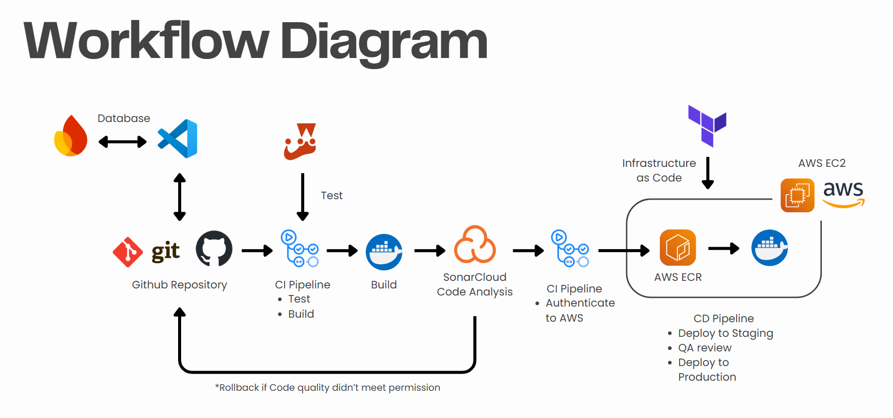

# Just List It.

## A Simple To-Do List Web App


### *About*:
Just List It is a straightforward web-based to-do list application developed with JavaScript. This project forks an open-source repository [Lordwill1/todo-list](https://github.com/Lordwill1/todo-list).

Its primary goal is to help users to record, manage, and complete their daily tasks. A key feature is that tasks are stored securely within each user's individual account, ensuring personalized and persistent access to their to-do lists.

To ensure rapid and reliable deployments, we implemented CI/CD for the project. It automatically builds the application, runs the unit tests, and deploys the app to the server.

### *Features*:
* User Registration & Login
* Personalized to-do list manager
* Themes: Users can choose from several theme options
* Cloud-based storage

### *Tools Used*:
* [](https://www.javascript.com/)
* 
* -303030?style=for-the-badge&logo=firebase&logoColor=DD2C00&labelColor=FFFFFF&color=303030&link=https%3A%2F%2Ffirebase.google.com%2F)
* 
* 
* 
* 

## **Getting Started**
To get a copy of "Just List It", follow these simple steps.
### *Prerequisites*:
Before you begin, ensure that you have installed the following in your system:
* Node.js
    * Make sure you have Node.js and npm (Node Package Manager) installed.
    * You can download it from [nodejs.org](nodejs.org).
* Git
    * For cloning the repository
    * You can download it from [git-scm.com](git-scm.com).
* Firebase Project
    * This "Just List It" project uses Firebase Authentication and Firestore.
    * You can build it from [console.firebase.google.com](console.firebase.google.com).

### *Installation*:
1. **Clone the Repository:**
```sh
git clone https://github.com/luthfan-ap/todo-list-devops-project.git
cd todo-list
```
2. **Install Dependencies (with NPM):**
```sh
npm install
```

### *Configuration:*
1. Set up your Firebase Project
   * Go to [Firebase Console](console.firebase.google.com).
   * Click "Create a Firebase Project" and follow the prompts to create a new project.
   * Once created, select your new project from the Firebase dashboard.
2. Register your Web App
   * In your Firebase Console, click the web (“</>”) icon to register a new web app.
   * Enter an app nickname (e.g., "Just List It App"), and click Register app.
   * You will be shown your Firebase SDK config (apiKey, authDomain, etc). Copy this config — you will use it in your project (usually in script.js).
3. Enable Firebase Authentication
   * In your Firebase Console sidebar, go to Build > Authentication.
   * Click "Get started".
   * In the Sign-in method tab, enable Email/Password authentication (or any other methods you want).
   * Save your changes.
4. Enable Firestore Database
   * In the sidebar, click Build > Firestore Database.
   * Click "Create database".
   * Select Start in test mode (recommended for development).
      > You can update security rules for production later.
   * Choose your database location (any is fine for most use cases) and click Next until done.
5. Add Firebase SDKs to your project
   * In your main HTML file (e.g., index.html), add these scripts before your main JavaScript files:
     ```sh
     <!-- Firebase App (core SDK) -->
     <script src="https://www.gstatic.com/firebasejs/10.11.1/firebase-app-compat.js"></script>
     <!-- Firebase Authentication -->
     <script src="https://www.gstatic.com/firebasejs/10.11.1/firebase-auth-compat.js"></script>
     <!-- Firebase Firestore -->
     <script src="https://www.gstatic.com/firebasejs/10.11.1/firebase-firestore-compat.js"></script>
     ```
6. Initialize Firebase in your code
   * In your JavaScript file (e.g., script.js), paste the config you copied earlier:
     ```sh
     const firebaseConfig = {
        apiKey: "YOUR_API_KEY",
        authDomain: "YOUR_PROJECT_ID.firebaseapp.com",
        projectId: "YOUR_PROJECT_ID",
        storageBucket: "YOUR_PROJECT_ID.appspot.com",
        messagingSenderId: "YOUR_SENDER_ID",
        appId: "YOUR_APP_ID"
     };
     // Initialize Firebase
     firebase.initializeApp(firebaseConfig);
     ```
7. Using Authentication and Firestore
   * Use firebase.auth() for authentication methods (register, login, logout, etc).
   * Use firebase.firestore() to read/write to Cloud Firestore.
     ```sh
     const db = firebase.firestore();
     const user = firebase.auth().currentUser;
     
     db.collection("todos").add({
        uid: user.uid,
        text: "My task",
        date: "2024-06-01",
        createdAt: firebase.firestore.FieldValue.serverTimestamp()
     });
     ```

Good luck and happy coding! 🚀

## **CI/CD Pipeline Overview**
This project implemented a Continuous Integration / Continuous Delivery (CI/CD) Pipeline to automate the software delivery process, ensuring a rapid and reliable deployments.

### *Pipeline Workflow*



Our CI/CD pipeline is automatically triggered by several specific events in the git repository:

* **Trigger:** Any *push* to the master branch or a *pull request* from the master branch will trigger the CI/CD Pipeline.
* **Build:**
    * Pulled the repository source codes.
    * Dependencies are installed.
    * The application is built into a production-ready container.
* **Test:**
    * Tests are done using Jest unit tests, which will be executed to the application that has just been built.
    * If any of the tests fail, the pipeline will stop immediately and return an error.
* **AWS Authentication:**
    * Authenticates to your AWS account
* **Push Image to AWS ECR:**
    * The built Docker Image will be pushed into AWS
    * Uses AWS ECR for storing the Docker images
* **Containerization & Deployment:**
    * The built application is dockerized and deployed to the server environment
    * In this project, we use EC2 (Elastic Compute Cloud) as our server infrastructure.

<!-- 
## *WEBSITE DEMO*


-->